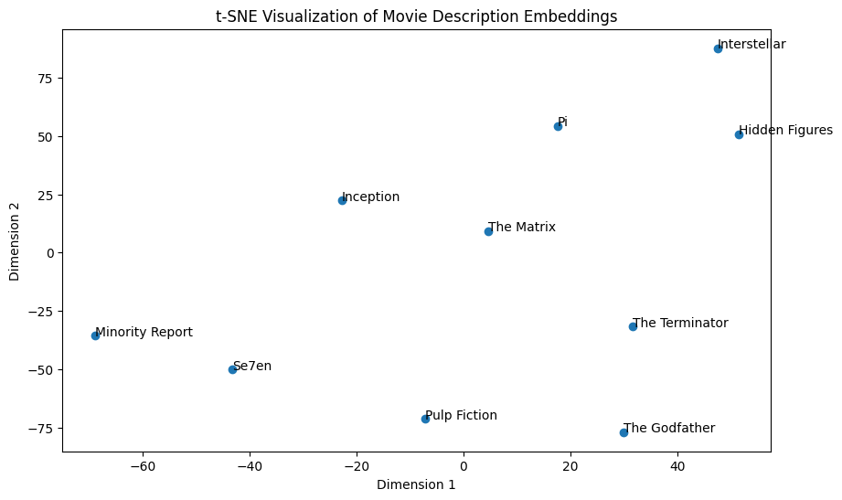

# Semantic Movie Discovery Engine 🎬

This project demonstrates how Natural Language Processing (NLP) can identify "hidden" thematic relationships between films that traditional genre tags might miss.

## 🚀 Technical Highlights
* **Vector Embeddings:** Converted text descriptions into 384-dimensional vectors using the `all-MiniLM-L6-v2` Sentence-Transformer model.
* **Dimensionality Reduction:** Utilized **t-SNE** to project high-dimensional data into a 2D map for visual cluster analysis.
* **Mathematical Similarity:** Implemented **Cosine Distance** calculations to perform "Zero-Shot" searches—identifying movies with "Romance" themes even if they aren't labeled as such.

## 📊 Visualization

*The t-SNE plot reveals how the AI clusters sci-fi films like 'Inception' and 'The Matrix' based on narrative structure rather than release date.*

## 🛠️ Tech Stack
* **Python** (Pandas, Numpy)
* **Scikit-Learn** (t-SNE, Metrics)
* **Sentence-Transformers** (SBERT)
* **Matplotlib** (Visualization)narrative context (e.g., 'Inception' and 'The Matrix' grouped together) and identified thematic overlaps that traditional genre tags often miss.
